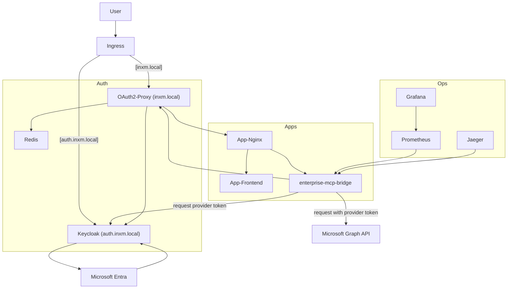
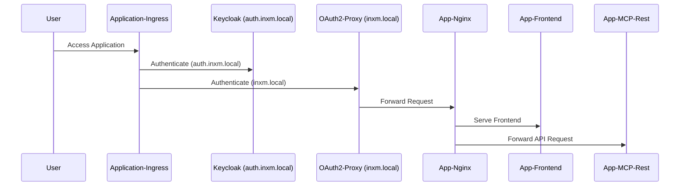
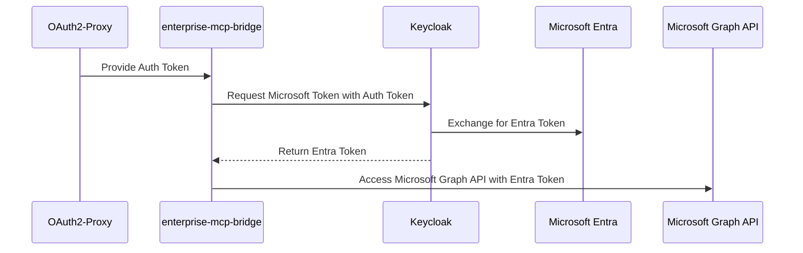

# Standalone Getting Started Example

This is a complete demo including authentication with m365

## Architecture



## Login Flow



## Request Graph API flow




## What it Provides
* Keycloak with token-exchange feature and ingress
* Automated Entra (Azure AD) app registration
* Enterprise MCP Bridge launched with `npx -y @softeria/ms-365-mcp-server --org-mode`
* Minimal frontend
* Tracing via Jaeger
* Monitoring via Prometheus

## Prerequisites
* Docker & Docker Compose [link](https://docs.docker.com/engine/install/)
* Azure CLI (`az`) [link](https://learn.microsoft.com/en-us/cli/azure/install-azure-cli?view=azure-cli-latest)
* A free Entra test account (create it [here](https://learn.microsoft.com/sk-sk/entra/verified-id/how-to-create-a-free-developer-account))
* A valid api token for the openai api (or any ai provider using the openai api standard)

## Run

```bash
./start.sh
```

Then open https://inxm.local

## Cleanup

```bash
./stop.sh
```
